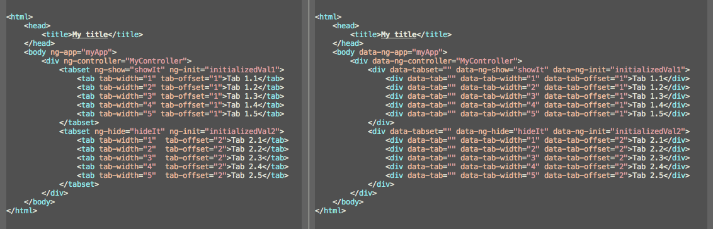

# nghtml-uglify [](http://travis-ci.org/narzac/nghtml-uglify)

> Uglify HTML files mixed with AngularJS directives such that it will be valid HTML5(Hopefully
 will significantly reduce IE issues as well)



*Issues with the output should be reported to
[issue tracker](https://github.com/narzac/nghtml-uglify/issues).*

## Install

Install with [npm](https://npmjs.org/package/nghtml-uglify)

```bash
# npm install -g nghtml-uglify
```

Note that, there is also a grunt task available

[grunt-nghtml-uglify](https://github.com/narzac/grunt-nghtml-uglify/)

## License

MIT © [Ahmet Yeşil](http://narzac.me)
